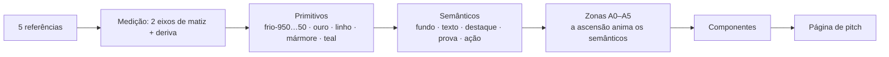

# Sfumato — design system do site de pitch

&lt;user\_quoted\_section&gt;Tese. O site é uma pintura que o visitante atravessa subindo: começa no abismo violeta, onde o problema mora, e termina na névoa branca, onde a visão aparece. Nada tem aresta. Todo tom se dissolve no seguinte (sfumato). A luz se move; o mármore fica parado.&lt;/user\_quoted\_section&gt;


| Decisão           | Valor                                                                                               | Origem                  |
| ----------------- | --------------------------------------------------------------------------------------------------- | ----------------------- |
| Público           | Banca de aceleradora                                                                                | resposta do Andrey      |
| Arco de luz       | **Ascensão**: escuro → claro ao longo do scroll                                                     | resposta do Andrey      |
| Ferramenta        | Framer ou Webflow. Recomendação: **Webflow** ([§8](#8-implementação-webflow-recomendado-ou-framer)) | resposta + recomendação |
| Modo do visitante | *Persuadir*: a banca precisa entender, acreditar e agir em segundos                                 | —                       |
| Evidência de cor  | Toda âncora medida por dois caminhos: [Medição da paleta](medicao-da-paleta)                        | medição                 |


## 1. O que as referências dizem, e o que está nas entrelinhas


| Referência                                                | O que se vê                                                                                         | O que está por trás                                                                                                                            | O que vira sistema                                                                        |
| --------------------------------------------------------- | --------------------------------------------------------------------------------------------------- | ---------------------------------------------------------------------------------------------------------------------------------------------- | ----------------------------------------------------------------------------------------- |
| **Crypto World's Fair** (site)                            | Fundo malva-escuro, molduras ornamentais, título em itálico serifado, valores de prêmio em destaque | É a gramática das *Exposições Universais* do séc. XIX: o site é um pavilhão e cada seção é uma sala                                            | Moldura de galeria para o demo, placas de prova para números, itálico como "voz"          |
| **Friedrich**, *Andarilho sobre o mar de névoa* (c. 1818) | Figura de costas no cume; névoa branco-azulada engole os vales                                      | *Rückenfigur*: vemos **pelo olhar dele**, e o espectador vira protagonista. Perspectiva atmosférica: quanto mais longe, mais claro e mais azul | O cume é o CTA. A banca olha o futuro "por trás do fundador". A névoa é a camada ambiente |
| **A queda** (óleo contemporâneo)                          | Corpo caindo no teal, camisa branca pincelada, luz vindo de cima                                    | A queda é o começo da jornada. O único branco quente é a camisa: **o branco é a figura, não o fundo**                                          | O hero fica no abismo, o branco é raro (&lt; 1% da área) e a luz desce em raios           |
| **Busto com óculos dourados**                             | Mármore, folha de ouro, lente âmbar                                                                 | O clássico com irreverência, que é o que uma startup faz com um mercado antigo                                                                 | O ouro é o **único** tom quente e "marmoriza" o retrato do time                           |
| **David** (Michelangelo, 1501–1504)                       | Mármore branco-lavanda, sombras malva                                                               | Esculpido na mesma Florença, nos mesmos anos, em que Leonardo levava o *sfumato* ao auge                                                       | O branco frio do topo da rampa; sombra nunca é cinza                                      |


### O achado medido: dois eixos de matiz


| Eixo                     | Matiz OKLCH medido | Onde aparece                                                         | Papel no sistema                                 |
| ------------------------ | ------------------ | -------------------------------------------------------------------- | ------------------------------------------------ |
| **Frio**: sombra → névoa | **271°–338°**      | Sombras de Friedrich, fundo do Crypto Fair, o David inteiro, a névoa | Toda a escala neutra, cerca de 90% da superfície |
| **Quente**: a luz        | **64°–96°**        | Folha de ouro, lente âmbar, mármore do busto, camisa branca          | Luz: CTA, prova, destaque                        |
| **Água**                 | **216°–222°**      | Teal do abismo                                                       | Profundidade e brilho vindo da superfície        |


- **"Sombras provenientes do mesmo aspecto" é literal.** Nas três obras de eixo frio, a sombra mais escura e o branco mais claro ficam a menos de 70° de distância no círculo de matiz. São o mesmo pigmento sob luzes diferentes.
- **A deriva.** Quanto mais escuro, mais magenta (≈ 318°); quanto mais claro, mais azul (≈ 274°). É perspectiva atmosférica medida, e a rampa reproduz isso.
- **O branco quente é ouro sem croma.** Mármore do busto e camisa ficam em 73°–96° com croma 0,008–0,038. A folha de ouro fica em 81°–83° com croma 0,09–0,11. Mesmo matiz, saturação diferente.
- **O orçamento de branco** (luma &gt; 80%, resolução cheia, duas vias concordando): **0,81%** do Crypto Fair, **0,63%** do abismo, **14,95%** de Friedrich.

## 2. As cinco leis

1. **Um pigmento, muitas luzes.** Todo neutro sai do eixo frio. Não existe cinza neutro no sistema.
2. **O branco é luz, não papel.** `#ffffff` e `#000000` são proibidos. Branco frio é névoa; branco quente é ouro sem croma. Cada zona tem um orçamento de branco ([§3](#3-cor)).
3. **Sfumato: nenhuma aresta dura.** A separação vem de tom, véu, gradiente e máscara pincelada. Linha de 1px só existe na moldura de galeria.
4. **A luz se move; o mármore fica.** Objeto não pula, não gira, não quica. Quem se move é a névoa, a água e o reflexo.
5. **A pincelada aparece.** Grão de tela e borda irregular nos reveals. O site tem que parecer pintado, não renderizado.

## 3. Cor

```wireframe
<!doctype html>
<html><head><meta charset="utf-8"><meta name="viewport" content="width=device-width,initial-scale=1">
<style>
*{box-sizing:border-box}
body{margin:0;padding:20px;background:#0e0910;color:#e5e7ef;font:13px/1.45 system-ui,-apple-system,sans-serif}
h2{font:italic 400 24px/1.2 'Bodoni Moda','Didot','Bodoni 72',Georgia,serif;margin:0 0 4px;color:#f4f5f9}
p{margin:0 0 14px;color:#91919d}
.lbl{font-size:12px;color:#afb0bd;margin:18px 0 6px}
.ramp{display:grid;grid-template-columns:repeat(11,minmax(0,1fr));gap:3px}
.warm{display:grid;grid-template-columns:repeat(5,minmax(0,1fr));gap:3px}
.sw{height:96px;padding:6px;display:flex;flex-direction:column;justify-content:flex-end;font-size:10.5px;border-radius:2px;overflow:hidden}
.sw b{font-size:11.5px;font-weight:600}
.sw small{opacity:.75;font-size:9.5px}
.l{color:#f4f5f9}.d{color:#171119}
.a::before{content:"●";font-size:9px;margin-bottom:auto}
.drift{margin-top:8px;height:10px;border-radius:5px;background:linear-gradient(90deg,#0e0910,#211a22,#4f4b55,#91919d,#cdd0dd,#f4f5f9)}
.axis{display:flex;justify-content:space-between;font-size:11px;color:#91919d;margin-top:4px}
@media (max-width:640px){.ramp{grid-template-columns:repeat(4,minmax(0,1fr))}.warm{grid-template-columns:repeat(2,minmax(0,1fr))}}
</style></head><body>
<h2>Um pigmento, muitas luzes</h2>
<p>● âncora medida por dois caminhos · os demais tons são interpolados na deriva medida</p>
<div class="lbl">Eixo frio — sombra → névoa — matiz 318° → 274°</div>
<div class="ramp">
<div class="sw l" style="background:#0e0910"><b>950</b>#0e0910</div>
<div class="sw l a" style="background:#171119"><b>900</b>#171119<small>sombra Friedrich</small></div>
<div class="sw l a" style="background:#211a22"><b>800</b>#211a22<small>fundo Crypto Fair</small></div>
<div class="sw l a" style="background:#312b34"><b>700</b>#312b34<small>malva Crypto Fair</small></div>
<div class="sw l" style="background:#4f4b55"><b>600</b>#4f4b55</div>
<div class="sw l" style="background:#72707b"><b>500</b>#72707b</div>
<div class="sw d a" style="background:#91919d"><b>400</b>#91919d<small>meio-tom David</small></div>
<div class="sw d" style="background:#afb0bd"><b>300</b>#afb0bd</div>
<div class="sw d a" style="background:#cdd0dd"><b>200</b>#cdd0dd<small>névoa</small></div>
<div class="sw d" style="background:#e5e7ef"><b>100</b>#e5e7ef</div>
<div class="sw d a" style="background:#f4f5f9"><b>50</b>#f4f5f9<small>branco David</small></div>
</div>
<div class="drift"></div><div class="axis"><span>malva-magenta 318°</span><span>azul-névoa 274°</span></div>
<div class="lbl">Eixo quente — a luz — 67°–85° · e a água — 219°</div>
<div class="warm">
<div class="sw d a" style="background:#be781d"><b>ouro-600</b>#be781d<small>âmbar da lente</small></div>
<div class="sw d a" style="background:#bd9952"><b>ouro-500</b>#bd9952<small>folha do louro</small></div>
<div class="sw d a" style="background:#cdbda6"><b>linho</b>#cdbda6<small>camisa do abismo</small></div>
<div class="sw d a" style="background:#dcd8cf"><b>mármore</b>#dcd8cf<small>busto</small></div>
<div class="sw l a" style="background:#2f4f58"><b>teal-abismo</b>#2f4f58<small>a água</small></div>
</div>
</body></html>
```

### 3.1 Primitivos

**Eixo frio.** É gerado em OKLCH com croma 0,018 (que afina para 0,006 perto do branco). O matiz cai linearmente de 318° (L 0,23) para 274° (L 0,86), que são os dois extremos medidos.


| Token      | Hex       | L   | h    | Âncora medida mais próxima                 |
| ---------- | --------- | --- | ---- | ------------------------------------------ |
| `frio-950` | `#0e0910` | .15 | 318° | — (abismo, além do medido)                 |
| `frio-900` | `#171119` | .19 | 318° | sombra de Friedrich `#151219` / `#161319`  |
| `frio-800` | `#211a22` | .23 | 318° | fundo do Crypto Fair `#1e1b1f` / `#1f1c20` |
| `frio-700` | `#312b34` | .30 | 313° | malva do Crypto Fair `#352b37` / `#29232a` |
| `frio-600` | `#4f4b55` | .42 | 305° | — (véu)                                    |
| `frio-500` | `#72707b` | .55 | 296° | — (véu)                                    |
| `frio-400` | `#91919d` | .66 | 288° | meio-tom do David `#85808e` / `#96919d`    |
| `frio-300` | `#afb0bd` | .76 | 281° | —                                          |
| `frio-200` | `#cdd0dd` | .86 | 274° | névoa de Friedrich `#c9cddb` / `#ccd0e0`   |
| `frio-100` | `#e5e7ef` | .93 | 274° | —                                          |
| `frio-50`  | `#f4f5f9` | .97 | 274° | branco do David `#f4f4f8` / `#f7f6fa`      |


**Eixo quente e água.** Cada token é o ponto médio OKLCH de um par de medições concordantes.


| Token         | Hex       | Papel                                | Par medido                             |
| ------------- | --------- | ------------------------------------ | -------------------------------------- |
| `ouro-600`    | `#be781d` | CTA pressionado, ouro mais quente    | âmbar da lente `#b67923` / `#c67717`   |
| `ouro-500`    | `#bd9952` | **CTA**, números de prova            | folha do louro `#be9445` / `#bd9d5e`   |
| `linho`       | `#cdbda6` | branco quente em fundo escuro (raro) | camisa do abismo `#cabca6` / `#d0bda6` |
| `marmore`     | `#dcd8cf` | superfície de retrato e busto        | mármore do busto `#e0ddd0` / `#d7d3ce` |
| `teal-abismo` | `#2f4f58` | luz da superfície vista de baixo     | teal do abismo `#2c525f` / `#314b52`   |


### 3.2 Semânticos: o que a ascensão anima


| Token                   | Zonas escuras (A0–A3)           | Zonas claras (A4–A5)       |
| ----------------------- | ------------------------------- | -------------------------- |
| `fundo`                 | frio-950 → frio-700             | frio-300 → frio-50         |
| `texto`                 | frio-50 / frio-100              | frio-900                   |
| `texto-suave`           | frio-400                        | frio-700                   |
| `destaque` (branco-luz) | frio-50 · `linho`               | frio-50 em faixa de luz    |
| `prova`                 | ouro-500                        | frio-900 sobre bloco-rocha |
| `acao` (CTA)            | fundo ouro-500 + texto frio-900 | o mesmo                    |
| `sombra`                | frio-950 com alfa               | frio-900 com alfa          |


### 3.3 Orçamento de branco e composição por zona


| Zona            | Branco (luma &gt; 80%)                       | Composição                                                    | Origem                                                                          |
| --------------- | -------------------------------------------- | ------------------------------------------------------------- | ------------------------------------------------------------------------------- |
| Escuras (A0–A3) | **≤ 1%** da área: texto principal e reflexos | ≈ 85% entre frio-800 e frio-700                               | Crypto Fair: 0,81%; abismo: 0,63%                                               |
| Claras (A4–A5)  | **≤ 15%** de luz plena (frio-100/50)         | ≈ 25–30% rocha (frio-900), o resto névoa média (frio-300/200) | Friedrich: 14,95% de branco; 27% escuro (`#19171c`, octree e k-means concordam) |


&lt;user\_quoted\_section&gt;O cume não é uma página branca. Mesmo a pintura mais clara das referências tem um quarto de rocha escura. Os blocos de prova e as imagens viram essas rochas.&lt;/user\_quoted\_section&gt;

### 3.4 Contraste (WCAG 2.x)


| Texto / fundo                         | Razão     |     |
| ------------------------------------- | --------- | --- |
| frio-50 / frio-900                    | 17,05 : 1 | AA  |
| frio-200 / frio-900                   | 12,08 : 1 | AA  |
| frio-400 / frio-900 (texto suave)     | 5,96 : 1  | AA  |
| frio-900 / frio-300 (zona Névoa)      | 8,64 : 1  | AA  |
| frio-700 / frio-100                   | 11,15 : 1 | AA  |
| ouro-500 / frio-900 (número de prova) | 6,94 : 1  | AA  |
| frio-900 / ouro-500 (texto do CTA)    | 6,94 : 1  | AA  |
| ouro-600 / frio-900                   | 5,21 : 1  | AA  |
| frio-50 / teal-abismo                 | 8,10 : 1  | AA  |


Regras que saem daí:

- Ouro **nunca** é texto sobre fundo claro, só preenchimento.
- Nenhum texto sobre fundo entre **frio-600 e frio-400**. Essa faixa é o véu.

## 4. A ascensão: mapa de altitudes

```wireframe
<!doctype html>
<html><head><meta charset="utf-8"><meta name="viewport" content="width=device-width,initial-scale=1">
<style>
*{box-sizing:border-box}
body{margin:0;background:#0e0910;font:13px/1.45 system-ui,sans-serif}
.z{position:relative;min-height:118px;padding:16px 24px;display:flex;justify-content:space-between;gap:16px;align-items:flex-start}
.z h4{margin:0;font:italic 400 21px/1.15 'Bodoni Moda','Didot','Bodoni 72',Georgia,serif}
.z p{margin:4px 0 0;font-size:12.5px;opacity:.85;max-width:52ch}
.tag{font-size:11px;white-space:nowrap;opacity:.7}
.a0{background:#0e0910;color:#f4f5f9}
.a1{background:radial-gradient(120% 95% at 50% -20%,rgba(47,79,88,.9),transparent 62%),#171119;color:#e5e7ef}
.a2{background:#211a22;color:#e5e7ef}
.gold{color:#bd9952}
.a3{background:linear-gradient(#211a22,#312b34);color:#e5e7ef}
.veu{position:relative;min-height:150px;overflow:hidden;background:linear-gradient(#312b34,#4f4b55 30%,#91919d 68%,#afb0bd)}
.veu::after{content:"";position:absolute;inset:-40px;background:radial-gradient(40% 50% at 28% 50%,rgba(229,231,239,.6),transparent 70%),radial-gradient(35% 45% at 74% 58%,rgba(205,208,221,.55),transparent 70%);filter:blur(18px)}
.veu span{position:absolute;left:24px;top:50%;transform:translateY(-50%);z-index:1;font-size:11.5px;color:#171119;opacity:.75}
.a4{background:#afb0bd;color:#171119}
.a5{background:linear-gradient(#cdd0dd,#e5e7ef 70%,#f4f5f9);color:#171119;min-height:160px}
.rock{display:inline-block;margin-top:10px;background:#171119;color:#e5e7ef;padding:8px 12px;font-size:11.5px;border-radius:2px}
.cta{display:inline-block;margin:10px 0 0 6px;background:#bd9952;color:#171119;padding:8px 18px;border-radius:999px;font-size:12px;font-weight:600}
.bar{position:fixed;right:6px;top:8px;bottom:8px;width:4px;border-radius:2px;background:linear-gradient(#0e0910,#2f4f58 28%,#312b34 44%,#afb0bd 70%,#f4f5f9)}
@media (max-width:560px){.z{flex-direction:column}}
</style></head><body>
<section class="z a0"><div><h4>A0 · Abismo</h4><p>Hero. frio-950, texto frio-50 (≥ 17:1). Branco ≤ 1% da área. A luz só chega de cima.</p></div><span class="tag">L .15 · 318°</span></section>
<section class="z a1"><div><h4>A1 · Correnteza</h4><p>frio-900 + brilho teal vindo da superfície. Raios lentos, camadas de imagem em parallax.</p></div><span class="tag">L .19 + teal</span></section>
<section class="z a2"><div><h4>A2 · Mármore</h4><p>frio-800. Entra a primeira luz quente: <span class="gold">ouro-500</span>, só em número e prova.</p></div><span class="tag">L .23 · ouro entra</span></section>
<section class="z a3"><div><h4>A3 · Superfície</h4><p>frio-800 → frio-700. Último texto claro antes da travessia.</p></div><span class="tag">L .30</span></section>
<div class="veu"><span>Véu de névoa — sem texto — L .42 → .76</span></div>
<section class="z a4"><div><h4>A4 · Névoa</h4><p>frio-300. O texto vira escuro (frio-900, 8,6:1). A rocha volta como bloco.</p><span class="rock">bloco-rocha · frio-900</span></div><span class="tag">L .76 · 281°</span></section>
<section class="z a5"><div><h4>A5 · Cume</h4><p>frio-200 → frio-50. Luz plena em ≤ 15% da área; ~25% ainda é rocha. O único CTA dourado da página.</p><span class="rock">rocha</span><span class="cta">Botão Luz</span></div><span class="tag">L .86 → .97 · 274°</span></section>
<div class="bar"></div>
</body></html>
```

&lt;!-- TODO(human): preencher a coluna "Momento do pitch" com a narrativa real da startup — qual momento do pitch mora em cada altitude. --&gt;


| Altitude          | Fundo                  | Texto         | Luz quente          | Movimento dominante                     | Momento do pitch |
| ----------------- | ---------------------- | ------------- | ------------------- | --------------------------------------- | ---------------- |
| **A0 Abismo**     | frio-950               | frio-50       | nenhuma             | correnteza lenta e raios vindos de cima | —                |
| **A1 Correnteza** | frio-900 + brilho teal | frio-100      | nenhuma             | parallax de imagem em camadas           | —                |
| **A2 Mármore**    | frio-800               | frio-100      | ouro-500 em números | luz rasante sobre placas                | —                |
| **A3 Superfície** | frio-800 → frio-700    | frio-100      | ouro-500            | pincelada nos títulos                   | —                |
| *Véu*             | frio-700 → frio-300    | **sem texto** | —                   | névoa ambiente + `scrub-agua`           | (travessia)      |
| **A4 Névoa**      | frio-300               | frio-900      | —                   | névoa ambiente, blocos-rocha            | —                |
| **A5 Cume**       | frio-200 → frio-50     | frio-900      | **CTA ouro-500**    | luz rasante no CTA                      | —                |


**Por que existe o véu.** Ao rolar com scrub, a cor de fundo passa por todos os tons do meio, e em L 0,42–0,66 nem texto claro nem texto escuro têm contraste confortável. A travessia acontece numa faixa de 60–100vh **sem texto**, só névoa. É a nuvem que o andarilho atravessa para chegar ao cume.

## 5. Tipografia


| Papel       | Face                                                           | Por quê                                                                                                                                                                                                                             |
| ----------- | -------------------------------------------------------------- | ----------------------------------------------------------------------------------------------------------------------------------------------------------------------------------------------------------------------------------- |
| **Display** | **Bodoni Moda** (Google Fonts, eixo de tamanho óptico)         | O *Manuale Tipografico* definitivo de Bodoni saiu em **1818**, o mesmo ano do *Andarilho*. O contraste extremo entre haste grossa e filete fino é claro-escuro em forma de letra: o filete é o destaque branco, a haste é a sombra. |
| **Texto**   | **Bricolage Grotesque** (Google Fonts, eixo de tamanho óptico) | Uma grotesca. A primeira sem-serifa comercial, de Caslon IV, é de c. **1816**. Display e texto nascem na mesma janela de três anos da pintura.                                                                                      |


| Token       | Face / peso                           | Tamanho (mobile → desktop) | Altura de linha | Uso                                                  |
| ----------- | ------------------------------------- | -------------------------- | --------------- | ---------------------------------------------------- |
| `display-1` | Bodoni Moda 400                       | 44 → 112 px                | 1.0             | Frase do hero                                        |
| `display-2` | Bodoni Moda 400, itálico misto        | 36 → 72 px                 | 1.05            | Título de seção                                      |
| `titulo-3`  | Bodoni Moda 500                       | 26 → 40 px                 | 1.1             | Subtítulos, nome em retrato                          |
| `numero`    | Bodoni Moda 400, algarismos alinhados | 56 → 120 px                | 1.0             | Placas de prova                                      |
| `corpo-l`   | Bricolage 400                         | 18 → 20 px                 | 1.5             | Lead                                                 |
| `corpo`     | Bricolage 400                         | 16 → 17 px                 | 1.55            | Texto, até 60 caracteres por linha                   |
| `rotulo`    | Bricolage 500                         | 13 px                      | 1.4             | Nav, legenda. Caixa normal, nunca versalete espaçado |


Regras:

- **O itálico é a voz.** Como no Crypto Fair ("*Welcome to the* Crypto World's Fair"), uma frase mistura romano e itálico. O itálico marca a palavra que sente; o romano, a que afirma.
- **Bodoni nunca abaixo de 26px.** Os filetes somem em tela de baixa densidade e em projetor.

## 6. Movimento

### 6.1 As cinco famílias


| Família         | De onde vem                      | O que se move                                                                                                                                                     | Onde                          |
| --------------- | -------------------------------- | ----------------------------------------------------------------------------------------------------------------------------------------------------------------- | ----------------------------- |
| **Névoa**       | Friedrich                        | Manchas desfocadas derivando em loops longos, com períodos primos entre si (23 s, 29 s, 37 s). Só se repetem a cada ≈ 6,9 h, então o olho nunca encontra o padrão | Véu, A4, A5                   |
| **Correnteza**  | A queda                          | Raios de luz balançando de cima; partículas subindo; imagens em parallax por profundidade                                                                         | A0, A1                        |
| **Pincelada**   | As pinceladas visíveis das obras | Títulos e blocos revelados por uma máscara de borda irregular que varre na direção do traço                                                                       | Todo título de seção          |
| **Luz rasante** | O mármore polido                 | Um reflexo branco (frio-50) cruza a superfície. O objeto fica parado e só a luz anda                                                                              | Placas, retratos, CTA (hover) |
| **Ascensão**    | O arco inteiro                   | Os tokens semânticos `fundo` e `texto` são animados pelo scroll, com atraso de "água"                                                                             | A página toda                 |


```wireframe
<!doctype html>
<html><head><meta charset="utf-8"><meta name="viewport" content="width=device-width,initial-scale=1">
<link rel="stylesheet" href="https://fonts.googleapis.com/css2?family=Bodoni+Moda:ital,opsz,wght@0,6..96,400..700;1,6..96,400..700&display=swap">
<style>
*{box-sizing:border-box}
body{margin:0;padding:14px;background:#0e0910;font:12px/1.45 system-ui,sans-serif}
.grid{display:grid;grid-template-columns:repeat(2,minmax(0,1fr));gap:10px}
.t{position:relative;height:220px;overflow:hidden;border-radius:3px;isolation:isolate}
.cap{position:absolute;left:12px;bottom:10px;z-index:5;font-size:12px;color:#e5e7ef}
.cap i{display:block;font-style:normal;color:#91919d;font-size:11px}
.nevoa{background:#171119}
.nevoa b{position:absolute;border-radius:50%;filter:blur(38px);opacity:.55}
.nevoa b:nth-child(1){width:60%;height:70%;left:-10%;top:5%;background:#4f4b55;animation:d1 23s ease-in-out infinite alternate}
.nevoa b:nth-child(2){width:55%;height:60%;left:40%;top:20%;background:#72707b;animation:d2 29s ease-in-out infinite alternate}
.nevoa b:nth-child(3){width:45%;height:50%;left:20%;top:45%;background:#cdd0dd;opacity:.22;animation:d3 37s ease-in-out infinite alternate}
@keyframes d1{to{transform:translate(18%,10%)}}
@keyframes d2{to{transform:translate(-22%,-8%)}}
@keyframes d3{to{transform:translate(12%,-14%)}}
.pincel{background:#211a22;display:flex;align-items:center;padding:0 20px}
.pincel h3{position:relative;margin:0 0 18px;font:italic 400 30px/1.1 'Bodoni Moda','Didot','Bodoni 72',Georgia,serif;color:#f4f5f9;animation:vis 4.8s infinite}
.pincel h3::after{content:"";position:absolute;inset:-14px -60px -14px -16px;background:#211a22;filter:url(#rough);animation:wipe 4.8s infinite}
@keyframes wipe{0%,8%{transform:translateX(0);animation-timing-function:cubic-bezier(.7,0,.2,1)}46%,100%{transform:translateX(112%)}}
@keyframes vis{0%,86%{opacity:1}94%,100%{opacity:0}}
.marmore{background:radial-gradient(80% 70% at 35% 30%,#e5e7ef,#afb0bd 60%,#72707b);display:grid;place-items:center}
.card{position:relative;width:60%;height:58%;margin-bottom:22px;border-radius:2px;background:linear-gradient(150deg,#f4f5f9,#cdd0dd 55%,#91919d);overflow:hidden;box-shadow:0 24px 48px -24px rgba(14,9,16,.7)}
.card::after{content:"";position:absolute;inset:0;background:linear-gradient(105deg,transparent 38%,rgba(244,245,249,.95) 50%,transparent 62%);transform:translateX(-120%);animation:sweep 3.8s infinite}
@keyframes sweep{0%,22%{transform:translateX(-120%);animation-timing-function:cubic-bezier(.16,1,.3,1)}72%,100%{transform:translateX(120%)}}
.marmore .cap{color:#171119}.marmore .cap i{color:#4f4b55}
.agua{background:linear-gradient(#2f4f58,#171119 85%)}
.raio{position:absolute;top:-20%;height:140%;background:linear-gradient(rgba(205,208,221,.35),transparent 70%);filter:blur(10px);animation:sway ease-in-out infinite alternate}
.r1{left:12%;width:18%;animation-duration:11s}
.r2{left:44%;width:10%;opacity:.7;animation-duration:13s}
.r3{left:68%;width:14%;opacity:.5;animation-duration:17s}
@keyframes sway{from{transform:translateX(-12px) skewX(-6deg)}to{transform:translateX(14px) skewX(5deg)}}
.bolha{position:absolute;bottom:-6px;width:3px;height:3px;border-radius:50%;background:#e5e7ef;opacity:0;animation:rise 9s linear infinite}
.b1{left:20%}.b2{left:35%;animation-delay:2s}.b3{left:58%;animation-delay:4.5s}.b4{left:76%;animation-delay:6s}.b5{left:48%;animation-delay:7.5s}
@keyframes rise{0%{transform:translateY(0);opacity:0}20%{opacity:.55}100%{transform:translateY(-230px);opacity:0}}
@media (prefers-reduced-motion:reduce){*,*::before,*::after{animation:none!important}.pincel h3::after,.card::after{display:none}}
@media (max-width:560px){.grid{grid-template-columns:minmax(0,1fr)}}
</style></head><body>
<svg width="0" height="0" style="position:absolute" aria-hidden="true"><filter id="rough" x="-20%" y="-30%" width="140%" height="160%"><feTurbulence type="fractalNoise" baseFrequency="0.03 0.28" numOctaves="3" seed="7"/><feDisplacementMap in="SourceGraphic" scale="30" xChannelSelector="R" yChannelSelector="G"/></filter></svg>
<div class="grid">
<div class="t nevoa"><b></b><b></b><b></b><div class="cap">Névoa<i>loops de 23/29/37 s — nunca sincronizam</i></div></div>
<div class="t pincel"><h3>Caímos para aprender a subir.</h3><div class="cap">Pincelada<i>900 ms · borda de cerdas · texto ilustrativo</i></div></div>
<div class="t marmore"><div class="card"></div><div class="cap">Luz rasante<i>o mármore fica, a luz atravessa</i></div></div>
<div class="t agua"><div class="raio r1"></div><div class="raio r2"></div><div class="raio r3"></div><span class="bolha b1"></span><span class="bolha b2"></span><span class="bolha b3"></span><span class="bolha b4"></span><span class="bolha b5"></span><div class="cap">Correnteza<i>raios de cima, partículas subindo</i></div></div>
</div>
</body></html>
```

### 6.2 Tokens de movimento


| Token           | Valor                            | Webflow (GSAP)     | Framer                         | Uso                                               |
| --------------- | -------------------------------- | ------------------ | ------------------------------ | ------------------------------------------------- |
| `dur-toque`     | 160 ms                           | `0.16`             | 0.16 s                         | feedback de clique e foco                         |
| `dur-gesto`     | 480 ms                           | `0.48`             | 0.48 s                         | hover, luz rasante curta                          |
| `dur-pincelada` | 900 ms                           | `0.9`              | 0.9 s                          | reveal de título e bloco                          |
| `dur-mare`      | 1400 ms                          | `1.4`              | 1.4 s                          | entrada de seção, troca de cena                   |
| `dur-respiro`   | 23 s · 29 s · 37 s               | `repeat: -1, yoyo` | loop                           | névoa e correnteza ambiente                       |
| `ease-nevoa`    | `cubic-bezier(0.16, 1, 0.3, 1)`  | ≈ `expo.out`       | Bezier com os mesmos 4 valores | tudo que **chega**: pousa devagar, como névoa     |
| `ease-mare`     | `cubic-bezier(0.65, 0, 0.35, 1)` | `power2.inOut`     | Bezier custom                  | loops de ida e volta                              |
| `ease-pincel`   | `cubic-bezier(0.7, 0, 0.2, 1)`   | ≈ `power3.inOut`   | Bezier custom                  | reveal pincelado: carrega a tinta, varre, arrasta |
| `scrub-agua`    | atraso de 1 s                    | `scrub: 1`         | —                              | ascensão e parallax presos ao scroll              |
| `stagger-gota`  | 60 ms entre itens                | `stagger: 0.06`    | atraso por filho               | listas, texto partido por palavra                 |


### 6.3 Coreografia

- **Uma camada ambiente por viewport.** Névoa *ou* correnteza, nunca as duas.
- **Só o ambiente é contínuo.** Névoa e correnteza vivem **atrás** do conteúdo e podem fazer loop. Pincelada, luz rasante e contagem de número rodam **uma vez** por elemento (na entrada ou no hover). Os loops das amostras acima existem só para demonstrar.
- **Conteúdo visível por padrão.** A banca lê na diagonal. Nenhum texto depende de animação para existir; a animação só embeleza a chegada.
- **Proibido:** quique e overshoot (`elastic`, `back`, spring com bounce), rotação, zoom-pop (escala &gt; 1,04), parallax em texto, scroll sequestrado (snap forçado, rolagem "presa"), cursor customizado.
- **Movimento reduzido** (`prefers-reduced-motion`): névoa e correnteza viram uma pintura estática; a pincelada vira fade de 200 ms; a luz rasante some. A **ascensão continua**, porque é cor ligada à posição e não movimento no tempo, mas sem parallax.

## 7. Textura, imagem e componentes

### 7.1 Materiais


| Material         | Receita                                                                                                                                |
| ---------------- | -------------------------------------------------------------------------------------------------------------------------------------- |
| **Grão de tela** | Ruído fractal em blend *overlay*: 6–8% de opacidade no escuro, 3–4% no claro. É estático, porque grão animado pesa e cansa             |
| **Pincelada**    | Máscaras SVG de pincel (3–5 formas reutilizáveis) e filtro de turbulência só na borda do reveal                                        |
| **Mármore**      | Retratos em duotone frio-900 → frio-50 com grão. "Marmorizar" o time como o David                                                      |
| **Sombra-rocha** | `0 24px 64px -24px rgb(14 9 16 / .6)`. Nunca sombra preta neutra                                                                       |
| **Sem halo**     | Nenhum brilho colorido parado (glow). A luz quente é o **reflexo que passa**, a luz rasante, nunca uma auréola fixa. Lei 4             |
| **Raio**         | 2px (pedra lapidada) em cartão e moldura; pílula (999px) em botão                                                                      |
| **Espaço**       | Base 4: 4 · 8 · 12 · 16 · 24 · 32 · 48 · 72 · 112 · 160. Seção com 112–160px verticais no desktop e 72px no mobile: respiro de galeria |


### 7.2 Componentes núcleo

```wireframe
<!doctype html>
<html><head><meta charset="utf-8"><meta name="viewport" content="width=device-width,initial-scale=1">
<link rel="stylesheet" href="https://fonts.googleapis.com/css2?family=Bodoni+Moda:ital,opsz,wght@0,6..96,400..700;1,6..96,400..700&family=Bricolage+Grotesque:opsz,wght@12..96,300..700&display=swap">
<style>
*{box-sizing:border-box}
:root{--f950:#0e0910;--f900:#171119;--f800:#211a22;--f700:#312b34;--f400:#91919d;--f200:#cdd0dd;--f100:#e5e7ef;--f50:#f4f5f9;--ouro:#bd9952;--teal:#2f4f58;--serif:'Bodoni Moda','Didot','Bodoni 72',Georgia,serif;--sans:'Bricolage Grotesque',system-ui,sans-serif}
body{margin:0;background:var(--f950);color:var(--f100);font:15px/1.55 var(--sans)}
.hero{position:relative;min-height:440px;padding:18px 28px 36px;overflow:hidden;background:radial-gradient(90% 70% at 50% -15%,rgba(47,79,88,.9),transparent 62%),var(--f950);display:flex;flex-direction:column}
.hero::before{content:"";position:absolute;inset:0;opacity:.09;pointer-events:none;mix-blend-mode:overlay;background-image:url("data:image/svg+xml;utf8,<svg xmlns='http://www.w3.org/2000/svg' width='160' height='160'><filter id='n'><feTurbulence type='fractalNoise' baseFrequency='.9' numOctaves='2' stitchTiles='stitch'/></filter><rect width='100%' height='100%' filter='url(%23n)'/></svg>")}
nav{position:relative;z-index:2;display:flex;justify-content:space-between;align-items:center;font-size:13px;color:var(--f400)}
nav b{font:italic 500 19px var(--serif);color:var(--f50)}
nav span{margin-left:18px}
.figura{position:absolute;right:6%;bottom:0;width:32%;height:76%;border:1px dashed rgba(205,208,221,.25);display:grid;place-items:center;text-align:center;font-size:12px;color:var(--f400);padding:10px}
.copy{position:relative;z-index:2;margin-top:auto;max-width:58%}
.kicker{font-size:13px;color:var(--f400)}
h1{margin:10px 0 14px;font:400 clamp(34px,6vw,64px)/1.02 var(--serif);color:var(--f50)}
h1 em{color:var(--f200)}
.lead{margin:0;color:var(--f400);max-width:44ch}
.btns{margin-top:22px;display:flex;gap:10px;flex-wrap:wrap}
.luz{background:var(--ouro);color:var(--f900);border-radius:999px;padding:11px 22px;font-weight:600;font-size:14px}
.nev{background:rgba(244,245,249,.08);color:var(--f100);border-radius:999px;padding:11px 22px;font-size:14px}
.comps{display:grid;grid-template-columns:1.4fr 1fr 1fr;gap:18px;padding:28px;background:var(--f800)}
.lbl{font-size:12px;color:var(--f400);margin-bottom:8px}
.moldura{aspect-ratio:16/10;padding:9px;background:var(--f900);border:1px solid rgba(189,153,82,.28);outline:1px solid rgba(189,153,82,.5);outline-offset:-6px}
.tela{height:100%;background:radial-gradient(60% 60% at 50% 40%,var(--f700),var(--f900));display:grid;place-items:center}
.play{width:42px;height:42px;border-radius:50%;background:var(--ouro);display:grid;place-items:center;color:var(--f900);font-size:13px}
.num{font:400 58px/1 var(--serif);color:var(--ouro);font-variant-numeric:lining-nums}
.rot{font-size:13px;color:var(--f400);margin-top:6px}
.foto{aspect-ratio:1;border-radius:2px;background:linear-gradient(160deg,var(--f50),var(--f400) 55%,var(--f900))}
.nome{margin-top:8px;font:italic 400 18px var(--serif);color:var(--f50)}
.cargo{font-size:13px;color:var(--f400)}
.divisor{grid-column:1/-1;width:100%;height:28px}
@media (max-width:720px){.copy{max-width:100%}.figura{display:none}.comps{grid-template-columns:minmax(0,1fr)}}
</style></head><body>
<header class="hero">
<nav><b>[Nome]</b><div><span>Problema</span><span>Produto</span><span>Tração</span><span>Time</span></div></nav>
<div class="figura">Pintura do hero<br>(Rückenfigur ou a queda)<br>asset a encomendar</div>
<div class="copy">
<div class="kicker">Demo Day · [aceleradora]</div>
<h1>[Promessa da startup] <em>em uma linha.</em></h1>
<p class="lead">Subtítulo em grotesca: o que fazemos, para quem, e por que agora — duas linhas no máximo.</p>
<div class="btns"><span class="luz">Botão Luz</span><span class="nev">Botão Névoa</span></div>
</div>
</header>
<section class="comps">
<div><div class="lbl">Moldura de galeria — demo</div><div class="moldura"><div class="tela"><div class="play">▶</div></div></div></div>
<div><div class="lbl">Placa de prova</div><div class="num">00%</div><div class="rot">[métrica real de tração]</div></div>
<div><div class="lbl">Retrato marmorizado</div><div class="foto"></div><div class="nome">[Fundador]</div><div class="cargo">[papel]</div></div>
<svg class="divisor" viewBox="0 0 600 28" preserveAspectRatio="none" aria-hidden="true"><path d="M4 16 C 120 6, 240 22, 360 12 S 560 10, 596 14" fill="none" stroke="rgba(244,245,249,.22)" stroke-width="5" stroke-linecap="round"/></svg>
</section>
</body></html>
```


| Componente              | Papel                             | Anatomia                                                                                     | Movimento                                            |
| ----------------------- | --------------------------------- | -------------------------------------------------------------------------------------------- | ---------------------------------------------------- |
| **Botão Luz**           | O único CTA primário de cada zona | Pílula, fundo ouro-500, texto frio-900 (6,94:1), sem halo; ouro-600 quando pressionado       | Luz rasante de 480 ms no hover                       |
| **Botão Névoa**         | Ação secundária                   | Pílula, fundo frio-50 a 8%, sem borda                                                        | O véu clareia no hover                               |
| **Moldura de galeria**  | Vídeo do demo, o pedido final     | Filete duplo ouro-500 (28% e 50%), cantos ornamentais em SVG. **É a única linha do sistema** | O conteúdo entra por pincelada                       |
| **Placa de prova**      | Métricas e tração                 | Número em Bodoni 56–120px ouro-500, rótulo grotesco 13px                                     | O número conta **uma vez** (900 ms, `ease-nevoa`)    |
| **Retrato marmorizado** | Time e mentores                   | Foto PB → duotone frio-900 → frio-50 com grão                                                | Luz rasante no hover                                 |
| **Divisor pincelado**   | Separar blocos sem linha dura     | Pincelada SVG em frio-50 a 20%                                                               | Desenha em 900 ms                                    |
| **Nav**                 | Navegação                         | Grotesca 13px sobre fundo transparente                                                       | Ganha véu (frio-950 a 70% + desfoque) depois do hero |
| **Véu de névoa**        | Travessia escuro → claro          | Faixa de 60–100vh sem texto, gradiente + névoa ambiente                                      | `scrub-agua`                                         |
| **Bloco-rocha**         | Prova dentro das zonas claras     | Fundo frio-900, texto frio-100, raio 2px, sombra-rocha                                       | Entra com `ease-nevoa`                               |


### 7.3 Imagem

- **Pintura acima de foto.** O hero precisa de **uma** pintura autoral que carregue a tese (o fundador como *Rückenfigur*, ou a queda), mais que de cinco imagens medianas.
- **Direitos.** Friedrich (morto em 1840) é domínio público. *A queda* é obra contemporânea, e o direito é do artista. O busto veio de um banco de imagens com marca d'água. A foto do David tem direito do fotógrafo, mesmo a estátua sendo pública. Para publicar, é preciso **encomendar ou licenciar**.

## 8. Implementação: Webflow (recomendado) ou Framer




| Peça                | Webflow (Interactions com GSAP)                                        | Framer                                                                                       |
| ------------------- | ---------------------------------------------------------------------- | -------------------------------------------------------------------------------------------- |
| Primitivos          | Variables, coleção "Primitivos"                                        | Color Styles                                                                                 |
| Semânticos          | Variables, coleção "Semântico" referenciando primitivos                | Color Styles com nome de papel                                                               |
| **Ascensão**        | **Animate Variable + ScrollTrigger com scrub** sobre `fundo` e `texto` | Componente de shader com estágios por scroll (ex.: *Fluid Scroll Shader*) ou fundo por seção |
| Pincelada em título | SplitText por palavra + stagger + máscara                              | Efeito de entrada por palavra                                                                |
| Névoa e correnteza  | Repetition com yoyo em camadas CSS, ou embed de canvas                 | Code component (React) ou componente do Marketplace                                          |
| Luz rasante         | Interação de hover numa pseudo-camada                                  | Variant de hover                                                                             |


**Por que Webflow.** O coração do sistema é a ascensão, e ela é literalmente *animar tokens de design conforme o scroll*. O Webflow faz isso nativamente desde que refez as Interactions sobre GSAP em 2025: Animate Variable, ScrollTrigger com scrub e SplitText, tudo sem código ([anúncio](https://webflow.com/updates/introducing-webflow-interactions-powered-by-gsap)).

**Quando Framer ganha.** Se o prazo for curto: ele publica mais rápido, e o Marketplace já tem shaders que trocam de paleta conforme o scroll ([exemplo](https://www.framer.com/community/marketplace/components/fluid-scroll-shader/)).

**A escolha final é do Andrey.**

## 9. Riscos e contras


| Risco                                    | Por quê                                                                                                                | Mitigação                                                                                                           |
| ---------------------------------------- | ---------------------------------------------------------------------------------------------------------------------- | ------------------------------------------------------------------------------------------------------------------- |
| **Projetor de demo day**                 | frio-950, 900 e 800 (L .15/.19/.23) viram o mesmo preto num projetor, e a subida das zonas escuras some                | A progressão escura também é marcada pelo teal e pelo ouro, não só pela luminância. Testar num projetor ou TV antes |
| **Desempenho**                           | Névoa desfocada, grão e shader pesam em notebook comum                                                                 | Uma camada ambiente por viewport, pausa fora da tela, fallback estático                                             |
| **Clichê "escuro + ouro = luxo cripto"** | O par é muito usado                                                                                                    | O que diferencia é a deriva violeta, o grão pintado e a ascensão. Sem esses três, vira template                     |
| **Halo teal vindo de cima**              | Gradiente radial colorido sobre fundo escuro é marca de interface gerada por IA (o detector do impeccable aponta isso) | Aqui ele é a luz da superfície da obra 3, e só vale **com** raios e grão. Liso e sozinho, vira clichê               |
| **Bodoni pequeno**                       | Os filetes somem                                                                                                       | Nunca abaixo de 26px, nunca em corpo                                                                                |
| **Contraste durante o scrub**            | Cores intermediárias derrubam a legibilidade                                                                           | Véu sem texto                                                                                                       |
| **Direitos de imagem**                   | Três das cinco referências têm dono                                                                                    | Encomendar ou licenciar ([§7.3](#73-imagem))                                                                        |
| **Movimento × leitura da banca**         | Jurado escaneia rápido                                                                                                 | Conteúdo visível por padrão; animação nunca é porta                                                                 |


## 10. Decisões em aberto

- Nome, proposta e conteúdo real da startup. Hoje o sistema é agnóstico ao produto, e os placeholders estão marcados com `[ ]`.
- Webflow ou Framer ([§8](#8-implementação-webflow-recomendado-ou-framer)).
- A pintura do hero: encomendar uma *Rückenfigur* do fundador ou uma cena de queda.
- O idioma do site (PT ou EN), conforme a aceleradora.
- O momento do pitch em cada altitude ([§4](#4-a-ascensão-mapa-de-altitudes)).

