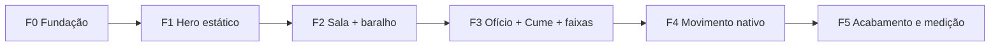

# Página da TW: plano de implementação no Webflow

&lt;user\_quoted\_section&gt;A página é curta: quatro telas. O pitch vive num baralho de 7 cartões sobrepostos que passa com um clique no cartão. O resto da página demonstra domínio de ferramenta, técnica e descrição, e faz isso mostrando o próprio design system Sfumato.&lt;/user\_quoted\_section&gt;


| Decisão         | Valor                                                                                                      | Origem |
| --------------- | ---------------------------------------------------------------------------------------------------------- | ------ |
| Produto         | **TW**: B2B, gera dinheiro no caixa da empresa cliente. A frase "estou sem dinheiro" deixa de ser problema | Andrey |
| Pitch           | Baralho de cartões sobrepostos; clique no cartão = próximo slide                                           | Andrey |
| Papel da página | Curta. Demonstrar domínio ferramental, técnico e descritivo                                                | Andrey |
| Ferramenta      | **Webflow**                                                                                                | Andrey |
| Ascensão        | Por **scroll**, nas 4 telas, e por **clique**, nos 7 cartões, cada um numa altitude                        | plano  |


## 1. A página em quatro telas


| #   | Tela                       | Zona / fundo                  | Altura | Conteúdo                                                 | Movimento                           |
| --- | -------------------------- | ----------------------------- | ------ | -------------------------------------------------------- | ----------------------------------- |
| 1   | **Hero**                   | Abismo · `frio-950`           | 100vh  | A frase apagada pela pincelada vira a promessa; 2 botões | Pincelada (1×), correnteza ambiente |
| 2   | **Sala do pitch** `#pitch` | **Véu** · `frio-600`          | 100vh  | Baralho de 7 cartões + dica de navegação                 | Névoa ambiente; troca de cartão     |
| 3   | **Ofício** `#oficio`       | Névoa · `frio-300`            | auto   | "Como esta página foi pintada": 4 blocos-rocha           | Pincelada nos títulos; luz rasante  |
| 4   | **Cume** `#contato`        | Cume · `frio-200` → `frio-50` | 70vh   | Convite final, Botão Luz, contato                        | Luz rasante no CTA                  |


Entre 1→2 e 2→3 há **faixas de transição** de 30–40vh, em degradê com névoa. A luminosidade só sobe: L .15 → .42 → .76 → .86–.97.

**Por que a sala mora no véu.** Se a sala tivesse a cor de um degrau da rampa, o cartão daquela altitude sumiria contra o fundo. Nos tons médios nenhum cartão mora, então os 7 se destacam. A dica de navegação usa `frio-50` sobre `frio-600`, com **7,80:1**. Sobre `frio-500` nenhum texto passaria no AA: o melhor par dá 4,46:1.

## 2. Conteúdo

### 2.1 Hero


| Elemento                                                               | Texto                                                                                                |
| ---------------------------------------------------------------------- | ---------------------------------------------------------------------------------------------------- |
| Nav (estática, não fixa)                                               | ***TW*** · Pitch · Ofício · Contato                                                                  |
| Kicker                                                                 | Demo Day · \[aceleradora\]                                                                           |
| Frase-fantasma (decorativa, `aria-hidden`, Bodoni itálico, `frio-400`) | *"Estou sem dinheiro."*                                                                              |
| **H1** (final, sempre no DOM)                                          | Dinheiro no bolso *da sua empresa.*                                                                  |
| Lead                                                                   | A TW gera caixa para empresas \[mecanismo, em uma frase\] e aposenta a frase mais antiga do negócio. |
| Botão Luz                                                              | Abrir o pitch → `#pitch`                                                                             |
| Botão Névoa                                                            | Ver como foi feito → `#oficio`                                                                       |


**A abertura.** A frase-fantasma aparece por 1,2 s. A pincelada passa por cima e apaga a frase, e debaixo dela surge o H1, palavra por palavra. O total é de 2,4 s. Lead e botões já estão visíveis desde o início, porque **nenhum texto depende de animação para existir**. Com movimento reduzido, só o H1 aparece.

### 2.2 Os 7 cartões: o pitch

A frase abre no abismo e volta **negada** no cume. A composição em anel é o argumento.


| #   | Altitude (mode) | Rótulo                | Título                                                | Corpo                                                                                  |
| --- | --------------- | --------------------- | ----------------------------------------------------- | -------------------------------------------------------------------------------------- |
| 1   | Abismo          | 01 · A frase          | *"Estou sem dinheiro."*                               | A frase mais antiga do caixa de uma empresa.                                           |
| 2   | Correnteza      | 02 · O problema       | Quando o caixa seca, *a empresa para.*                | \[O custo da falta de caixa para o cliente B2B, um número com fonte\]                  |
| 3   | Mármore         | 03 · A TW             | **TW** (em ouro): dinheiro no bolso *da sua empresa.* | \[O que a TW faz, em uma frase\]                                                       |
| 4   | Superfície      | 04 · Como funciona    | Do pedido *ao caixa.*                                 | \[passo 1\] → \[passo 2\] → dinheiro na conta                                          |
| 5   | Névoa           | 05 · Prova            | O que já *saiu do papel.*                             | 3 placas de prova ([§2.3](#23-placas-de-prova-cartão-5))                               |
| 6   | Alto            | 06 · Mercado e modelo | Onde a TW *ganha dinheiro.*                           | \[Tamanho do mercado, com fonte\] · \[Modelo de receita\]                              |
| 7   | Cume            | 07 · O pedido         | Nunca mais *"estou sem dinheiro".*                    | \[O que pedimos à banca\] · retratos marmorizados do time · Botão Luz "Falar com a TW" |


### 2.3 Placas de prova (cartão 5)

São blocos-rocha (`frio-900`) com número em Bodoni `ouro-500`, a 6,94:1.


| Número     | Rótulo                         |
| ---------- | ------------------------------ |
| R$ \[—\]   | gerados no caixa de clientes   |
| \[—\] dias | do pedido ao dinheiro na conta |
| \[—\]      | empresas atendidas             |


&lt;user\_quoted\_section&gt;Os rótulos são sugestões para confirmar. Nenhum número pode ser inventado: placa sem número real sai da página, não ganha número de enfeite.&lt;/user\_quoted\_section&gt;

### 2.4 Ofício: "Como esta página *foi pintada.*"


| Bloco-rocha                        | Texto                                                                                                                                                       |
| ---------------------------------- | ----------------------------------------------------------------------------------------------------------------------------------------------------------- |
| **Cor medida, não escolhida.**     | Cada cor saiu de cinco obras de referência e foi medida por dois algoritmos independentes. Sombras e névoa caem num único eixo de matiz, entre 271° e 338°. |
| **Branco com orçamento.**          | Nas pinturas escuras de referência, o branco ocupa menos de 1% da tela (0,81% e 0,63%). Aqui também: ele é luz, não papel.                                  |
| **A luz se move; o mármore fica.** | Cinco famílias de movimento: névoa, correnteza, pincelada, luz rasante e ascensão. Nada quica, nada gira.                                                   |
| **Feito em Webflow.**              | Variables com modes: uma altitude por seção e por cartão. Interactions com GSAP para texto, reflexo e névoa. Um script curto para o baralho.                |


As frases são verdadeiras **por construção**. A do branco tem que ser medida na página pronta ([F5](#8-ordem-de-construção)).

### 2.5 Cume

- **Título:** Vamos *conversar.*
- **Lead:** \[uma frase de convite\]
- **Botão Luz:** Falar com a TW → \[contato\]
- **Rodapé:** TW · 2026

### 2.6 Lista de substituição


| #   | O que falta                              | Onde                   |
| --- | ---------------------------------------- | ---------------------- |
| 1   | Mecanismo da TW, em uma frase            | Lead do hero, cartão 3 |
| 2   | Nome da aceleradora                      | Kicker do hero         |
| 3   | Custo do problema, com fonte             | Cartão 2               |
| 4   | Passos do produto                        | Cartão 4               |
| 5   | 3 números reais e os rótulos confirmados | Cartão 5               |
| 6   | Mercado (com fonte) e modelo de receita  | Cartão 6               |
| 7   | O pedido à banca                         | Cartão 7               |
| 8   | Fotos, nomes e papéis do time            | Cartão 7               |
| 9   | Contato (e-mail ou agenda)               | Cume                   |
| 10  | Pintura do hero (encomenda ou licença)   | Hero                   |
| 11  | Idioma: PT ou EN                         | Tudo                   |


## 3. Protótipo do baralho

Clique no cartão, ou use Enter, espaço ou →. É o mesmo CSS e a mesma lógica do código de produção ([§7](#7-código-customizado-o-único)), exceto o "voltar".

```wireframe
<!doctype html>
<html lang="pt-BR"><head><meta charset="utf-8"><meta name="viewport" content="width=device-width,initial-scale=1">
<link rel="stylesheet" href="https://fonts.googleapis.com/css2?family=Bodoni+Moda:ital,opsz,wght@0,6..96,400..700;1,6..96,400..700&family=Bricolage+Grotesque:opsz,wght@12..96,300..700&display=swap">
<style>
*{box-sizing:border-box}
:root{--serif:'Bodoni Moda','Didot','Bodoni 72',Georgia,serif;--sans:'Bricolage Grotesque',system-ui,sans-serif;--ease-nevoa:cubic-bezier(.16,1,.3,1);--ease-pincel:cubic-bezier(.7,0,.2,1)}
body{margin:0;background:#4f4b55;color:#f4f5f9;font:15px/1.5 var(--sans)}
.sala{position:relative;min-height:620px;display:flex;flex-direction:column;align-items:center;justify-content:center;gap:20px;padding:80px 16px 28px;overflow:hidden}
.sala::before{content:"";position:absolute;inset:-12%;background:radial-gradient(40% 38% at 25% 30%,rgba(145,145,157,.35),transparent 70%),radial-gradient(38% 42% at 78% 70%,rgba(114,112,123,.45),transparent 70%);animation:deriva 29s ease-in-out infinite alternate}
@keyframes deriva{to{transform:translate(4%,-3%)}}
[data-baralho]{position:relative;display:grid;width:min(760px,100%)}
[data-baralho]>*{grid-area:1/1;position:relative;min-height:clamp(380px,52vw,470px);padding:clamp(20px,4vw,44px);border-radius:2px;display:flex;flex-direction:column;justify-content:space-between;gap:14px;cursor:pointer;background:var(--fundo);color:var(--texto);box-shadow:0 24px 64px -24px rgb(14 9 16 / .6);transition:transform .9s var(--ease-nevoa),opacity .9s var(--ease-nevoa),filter .9s var(--ease-nevoa)}
[data-baralho]>*::after{content:"";position:absolute;inset:0;border-radius:inherit;background:#cdd0dd;opacity:0;pointer-events:none;transition:opacity .9s var(--ease-nevoa)}
[data-baralho]>:nth-child(1){z-index:3}
[data-baralho]>:nth-child(2){z-index:2;transform:translateY(-5%) scale(.95)}
[data-baralho]>:nth-child(2)::after{opacity:.18}
[data-baralho]>:nth-child(3){z-index:1;transform:translateY(-10%) scale(.9)}
[data-baralho]>:nth-child(3)::after{opacity:.36}
[data-baralho]>:nth-child(n+4){opacity:0;pointer-events:none;transform:translateY(-14%) scale(.86)}
[data-baralho]>.sai{transform:translateY(35%);opacity:0;filter:blur(8px);transition-timing-function:var(--ease-pincel)}
[data-baralho]>*:focus-visible{outline:2px solid #bd9952;outline-offset:4px}
.topo{display:flex;justify-content:space-between;gap:12px;font-size:13px;color:var(--suave)}
.topo i{font:italic 500 16px var(--serif);color:var(--texto)}
.cartao h3{margin:0;font:400 clamp(28px,5vw,52px)/1.05 var(--serif)}
.cartao p{margin:0;max-width:46ch;color:var(--suave);font-size:clamp(14px,1.7vw,16px)}
.ouro{color:#bd9952}
.placas{display:flex;gap:8px;flex-wrap:wrap}
.rocha{background:#171119;padding:10px 14px;border-radius:2px;min-width:140px}
.rocha b{display:block;font:400 clamp(24px,3.4vw,34px)/1 var(--serif);color:#bd9952}
.rocha span{font-size:12px;color:#91919d}
.fim{display:flex;justify-content:space-between;align-items:flex-end;gap:12px;flex-wrap:wrap}
.cta{background:#bd9952;color:#171119;border:0;border-radius:999px;padding:11px 22px;font:600 14px var(--sans);cursor:pointer}
.dica{position:relative;margin:0;font-size:13px;color:#e5e7ef}
.is-abismo{--fundo:#0e0910;--texto:#f4f5f9;--suave:#91919d}
.is-correnteza{--fundo:radial-gradient(120% 90% at 50% -25%,rgba(47,79,88,.9),transparent 60%),#171119;--texto:#e5e7ef;--suave:#91919d}
.is-marmore{--fundo:#211a22;--texto:#e5e7ef;--suave:#91919d}
.is-superficie{--fundo:#312b34;--texto:#e5e7ef;--suave:#afb0bd}
.is-nevoa{--fundo:#afb0bd;--texto:#171119;--suave:#312b34}
.is-alto{--fundo:#cdd0dd;--texto:#171119;--suave:#312b34}
.is-cume{--fundo:#f4f5f9;--texto:#171119;--suave:#312b34}
@media (prefers-reduced-motion:reduce){.sala::before{animation:none}[data-baralho]>*{transition:opacity .2s}[data-baralho]>.sai{transform:none;filter:none}}
</style></head><body>
<section class="sala" id="pitch">
<div data-baralho role="region" aria-roledescription="baralho" aria-label="Pitch da TW em 7 cartões">
<article class="cartao is-abismo" aria-roledescription="cartão"><div class="topo"><span>01 · A frase</span><i>TW</i></div><h3><em>“Estou sem dinheiro.”</em></h3><p>A frase mais antiga do caixa de uma empresa.</p></article>
<article class="cartao is-correnteza" aria-roledescription="cartão"><div class="topo"><span>02 · O problema</span><i>TW</i></div><h3>Quando o caixa seca, <em>a empresa para.</em></h3><p>[O custo da falta de caixa para o cliente B2B, um número com fonte]</p></article>
<article class="cartao is-marmore" aria-roledescription="cartão"><div class="topo"><span>03 · A TW</span><i>TW</i></div><h3><span class="ouro">TW</span>: dinheiro no bolso <em>da sua empresa.</em></h3><p>[O que a TW faz, em uma frase]</p></article>
<article class="cartao is-superficie" aria-roledescription="cartão"><div class="topo"><span>04 · Como funciona</span><i>TW</i></div><h3>Do pedido <em>ao caixa.</em></h3><p>[passo 1] → [passo 2] → dinheiro na conta</p></article>
<article class="cartao is-nevoa" aria-roledescription="cartão"><div class="topo"><span>05 · Prova</span><i>TW</i></div><h3>O que já <em>saiu do papel.</em></h3><div class="placas"><div class="rocha"><b>R$ —</b><span>gerados no caixa de clientes</span></div><div class="rocha"><b>— dias</b><span>do pedido ao dinheiro</span></div><div class="rocha"><b>—</b><span>empresas atendidas</span></div></div></article>
<article class="cartao is-alto" aria-roledescription="cartão"><div class="topo"><span>06 · Mercado e modelo</span><i>TW</i></div><h3>Onde a TW <em>ganha dinheiro.</em></h3><p>[Tamanho do mercado, com fonte] · [Modelo de receita]</p></article>
<article class="cartao is-cume" aria-roledescription="cartão"><div class="topo"><span>07 · O pedido</span><i>TW</i></div><h3>Nunca mais <em>“estou sem dinheiro”.</em></h3><div class="fim"><p>[O que pedimos à banca]</p><button class="cta" type="button">Falar com a TW</button></div></article>
</div>
<p class="dica">Clique no cartão para avançar · Enter ou → no teclado · <span data-baralho-aviso aria-live="polite"></span></p>
</section>
<script>
document.querySelectorAll('[data-baralho]').forEach((baralho) => {
  const cartoes = [...baralho.children];
  const aviso = baralho.parentElement.querySelector('[data-baralho-aviso]');
  let ocupado = false;
  function atualizar() {
    [...baralho.children].forEach((c, i) => { c.tabIndex = i === 0 ? 0 : -1; c.setAttribute('aria-hidden', String(i !== 0)); });
    if (aviso) aviso.textContent = 'Cartão ' + (cartoes.indexOf(baralho.firstElementChild) + 1) + ' de ' + cartoes.length;
  }
  function avancar() {
    if (ocupado) return;
    ocupado = true;
    const frente = baralho.firstElementChild;
    const fim = (e) => {
      if (e.target !== frente || e.pseudoElement || e.propertyName !== 'opacity') return;
      frente.removeEventListener('transitionend', fim);
      frente.classList.remove('sai');
      baralho.append(frente);
      ocupado = false;
      atualizar();
      baralho.firstElementChild.focus({preventScroll: true});
    };
    frente.addEventListener('transitionend', fim);
    frente.classList.add('sai');
  }
  baralho.addEventListener('click', (e) => {
    if (e.target.closest('a, button')) return;
    if (baralho.firstElementChild.contains(e.target)) avancar();
  });
  baralho.addEventListener('keydown', (e) => {
    if (e.target.closest('a, button')) return;
    if (e.key === 'Enter' || e.key === ' ' || e.key === 'ArrowRight') { e.preventDefault(); avancar(); }
  });
  atualizar();
});
</script>
</body></html>
```

## 4. Variables

Três coleções. No Webflow cada variable vira uma propriedade CSS com nome em minúsculas e hífens. Para pegar o nome **exato** que o código customizado usa, use o botão *Copy CSS* do painel ([Webflow](https://webflow.com/webflow-way/design-systems/variables)).

### 4.1 Coleção `Primitivos` (sem modes)


| Grupo  | Variables                                                                                                                                                                                                                                                 |
| ------ | --------------------------------------------------------------------------------------------------------------------------------------------------------------------------------------------------------------------------------------------------------- |
| Frio   | `frio-950` `#0e0910` · `frio-900` `#171119` · `frio-800` `#211a22` · `frio-700` `#312b34` · `frio-600` `#4f4b55` · `frio-500` `#72707b` · `frio-400` `#91919d` · `frio-300` `#afb0bd` · `frio-200` `#cdd0dd` · `frio-100` `#e5e7ef` · `frio-50` `#f4f5f9` |
| Quente | `ouro-600` `#be781d` · `ouro-500` `#bd9952` · `linho` `#cdbda6` · `marmore` `#dcd8cf`                                                                                                                                                                     |
| Água   | `teal-abismo` `#2f4f58`                                                                                                                                                                                                                                   |
| Fontes | `serif` Bodoni Moda · `sans` Bricolage Grotesque, as duas via Google Fonts em *Site settings → Fonts*                                                                                                                                                     |


### 4.2 Coleção `Semântico`: 8 modes manuais, um por altitude

Cada mode é aplicado por **classe combo**: `.zona.is-abismo`, `.cartao.is-nevoa` etc. Assim o mesmo componente muda de altitude sem duplicar estilo. Todas as variables apontam para `Primitivos`. Entre parênteses vai o contraste do texto sobre o `fundo` daquele mode.


| Variable      | Abismo          | Correnteza       | Mármore          | Superfície          | **Véu**         | Névoa           | Alto             | Cume             |
| ------------- | --------------- | ---------------- | ---------------- | ------------------- | --------------- | --------------- | ---------------- | ---------------- |
| `fundo`       | frio-950        | frio-900         | frio-800         | frio-700            | frio-600        | frio-300        | frio-200         | frio-50          |
| `texto`       | frio-50 (18,10) | frio-100 (15,04) | frio-100 (13,77) | frio-100 (11,15)    | frio-50 (7,80)  | frio-900 (8,64) | frio-900 (12,08) | frio-900 (17,05) |
| `texto-suave` | frio-400 (6,33) | frio-400 (5,96)  | frio-400 (5,46)  | **frio-300** (6,40) | frio-100 (6,89) | frio-700 (6,40) | frio-700 (8,95)  | frio-700 (12,63) |
| `prova`       | ouro-500 (7,36) | ouro-500 (6,94)  | ouro-500 (6,35)  | ouro-500 (5,14)     | frio-50 (7,80)  | frio-900 (8,64) | frio-900 (12,08) | frio-900 (17,05) |


- **Por que a Superfície usa `frio-300` como texto suave.** `frio-400` sobre `frio-700` dá **4,42:1** e reprova no AA para texto normal.
- **Onde cada mode aparece.** Hero = Abismo; sala = Véu; Ofício = Névoa; Cume = Cume; os cartões usam do Abismo ao Cume.
- **O brilho teal da Correnteza** é um gradiente, e Variable de cor não guarda gradiente. Ele fica no estilo da classe combo `.is-correnteza`.

### 4.3 Coleção `Medidas`: modes automáticos por breakpoint

O mode automático troca o valor sozinho em cada breakpoint.


| Variable       | Desktop | Tablet | Mobile |
| -------------- | ------- | ------ | ------ |
| `display-1`    | 112px   | 72px   | 44px   |
| `display-2`    | 72px    | 52px   | 36px   |
| `titulo-3`     | 40px    | 32px   | 26px   |
| `numero`       | 120px   | 88px   | 56px   |
| `corpo-l`      | 20px    | 19px   | 18px   |
| `corpo`        | 17px    | 16px   | 16px   |
| `espaco-secao` | 160px   | 112px  | 72px   |
| `cartao-pad`   | 48px    | 36px   | 24px   |


## 5. Classes


| Classe / atributo                                                                  | Papel                                                     |
| ---------------------------------------------------------------------------------- | --------------------------------------------------------- |
| `zona` + `is-abismo` · `is-veu` · `is-nevoa` · `is-cume`                           | Seção; o combo aplica o mode                              |
| `cartao` + `is-abismo` … `is-cume`                                                 | Cartão; o combo aplica o mode                             |
| `[data-baralho]` · `[data-baralho-aviso]`                                          | Ganchos do script e do anúncio para leitor de tela        |
| `display-1` · `display-2` · `titulo-3` · `numero` · `corpo-l` · `corpo` · `rotulo` | Tipografia (§5 do design system)                          |
| `botao-luz` · `botao-nevoa` · `rocha`                                              | Componentes                                               |
| `reflexo`                                                                          | Filho do botão, placa ou retrato que recebe a luz rasante |
| `pincel-veu`                                                                       | Camada que varre na pincelada                             |
| `nevoa-mancha` · `raio`                                                            | Camadas ambientes                                         |
| `grao`                                                                             | Camada fixa de ruído, em blend overlay                    |


## 6. Interactions com GSAP (nativas, sem código)

Gatilhos disponíveis: Click, Hover, Scroll, Page load, Mouse move e Custom event. O alvo pode ser classe, ID, atributo ou o próprio elemento que disparou, com escopo de descendentes ou ancestrais ([Webflow Help](https://help.webflow.com/hc/en-us/articles/42832349989395-Triggers-targets-in-Interactions-with-GSAP)).


| #   | Interação              | Gatilho                              | Alvo                                            | Ação                                                                                                       | Tempo                                                                                     |
| --- | ---------------------- | ------------------------------------ | ----------------------------------------------- | ---------------------------------------------------------------------------------------------------------- | ----------------------------------------------------------------------------------------- |
| I1  | **Frase → promessa**   | Page load                            | `.pincel-veu`, `.frase-fantasma` e `h1` do hero | A camada cobre a frase, a frase some, a camada segue e descobre o H1. O H1 entra por SplitText de palavras | 2,4 s no total · `power3.inOut` na camada · `expo.out` com stagger de 0,06 s nas palavras |
| I2  | **Títulos pincelados** | Scroll, entrada na viewport, uma vez | `.display-2`                                    | SplitText por palavra: y 24 → 0, opacidade 0 → 1                                                           | 0,9 s · `expo.out` · stagger 0,06 s                                                       |
| I3  | **Luz rasante**        | Hover                                | `.reflexo` (primeiro descendente)               | x −120% → 120%                                                                                             | 0,48 s · `expo.out`                                                                       |
| I4  | **Névoa**              | Page load                            | `.nevoa-mancha` (3)                             | Deriva x/y, Repetition infinita com yoyo                                                                   | 23 / 29 / 37 s · `sine.inOut`                                                             |
| I5  | **Correnteza**         | Page load                            | `.raio` (3)                                     | x ±14px, skewX ±6°, yoyo                                                                                   | 11 / 13 / 17 s                                                                            |


- **A ascensão de scroll não precisa de Animate Variable.** Como a página é curta, cada seção tem cor fixa pelo mode, e as faixas de transição são degradês. O Animate Variable fica de reserva.
- **Nav estática no topo do hero.** Numa página de 4 telas, uma nav fixa que muda de cor seria complexidade sem ganho.
- **Desempenho.** Faça as manchas de névoa com `radial-gradient` (já são suaves de nascença) em vez de `filter: blur()` em elementos grandes, que pesa no notebook da banca.

## 7. Código customizado (o único)

&lt;user\_quoted\_section&gt;⚠ Publicar código customizado exige plano pago: plano de site ou workspace Core/Growth/Agency/Freelancer (Webflow Help). Sem plano pago, use a alternativa sem código.&lt;/user\_quoted\_section&gt;

O script **não usa GSAP**: a saída do cartão é uma transição CSS. Ele só move o cartão no DOM e cuida de foco e anúncio. Cole o bloco em *Page settings → Custom code → Before `</body>`*. Os nomes `--frio-200` etc. devem ser conferidos com o *Copy CSS*.

```html
<style>
[data-baralho]{--ease-nevoa:cubic-bezier(.16,1,.3,1);--ease-pincel:cubic-bezier(.7,0,.2,1);display:grid}
[data-baralho]>*{grid-area:1/1;position:relative;cursor:pointer;transition:transform .9s var(--ease-nevoa),opacity .9s var(--ease-nevoa),filter .9s var(--ease-nevoa)}
[data-baralho]>*::after{content:"";position:absolute;inset:0;border-radius:inherit;background:var(--frio-200);opacity:0;pointer-events:none;transition:opacity .9s var(--ease-nevoa)}
[data-baralho]>:nth-child(1){z-index:3}
[data-baralho]>:nth-child(2){z-index:2;transform:translateY(-5%) scale(.95)}
[data-baralho]>:nth-child(2)::after{opacity:.18}
[data-baralho]>:nth-child(3){z-index:1;transform:translateY(-10%) scale(.9)}
[data-baralho]>:nth-child(3)::after{opacity:.36}
[data-baralho]>:nth-child(n+4){opacity:0;pointer-events:none;transform:translateY(-14%) scale(.86)}
[data-baralho]>.sai{transform:translateY(35%);opacity:0;filter:blur(8px);transition-timing-function:var(--ease-pincel)}
@media (prefers-reduced-motion:reduce){[data-baralho]>*{transition:opacity .2s}[data-baralho]>.sai{transform:none;filter:none}}
</style>
<script>
// Baralho da TW. A ordem no DOM é o estado: o cartão da frente é sempre o primeiro filho.
document.querySelectorAll('[data-baralho]').forEach((baralho) => {
  const cartoes = [...baralho.children];
  const aviso = baralho.parentElement.querySelector('[data-baralho-aviso]');
  let ocupado = false;

  function atualizar() {
    [...baralho.children].forEach((c, i) => { c.tabIndex = i === 0 ? 0 : -1; c.setAttribute('aria-hidden', String(i !== 0)); });
    if (aviso) aviso.textContent = 'Cartão ' + (cartoes.indexOf(baralho.firstElementChild) + 1) + ' de ' + cartoes.length;
  }

  function avancar() {
    if (ocupado) return;
    ocupado = true;
    const frente = baralho.firstElementChild;
    const fim = (e) => {
      // só a transição de opacidade do próprio cartão encerra a saída (a névoa ::after também dispara transitionend)
      if (e.target !== frente || e.pseudoElement || e.propertyName !== 'opacity') return;
      frente.removeEventListener('transitionend', fim);
      frente.classList.remove('sai');
      baralho.append(frente);              // vai para o fundo da pilha; o :nth-child reempilha os outros
      ocupado = false;
      atualizar();
      baralho.firstElementChild.focus({preventScroll: true});
    };
    frente.addEventListener('transitionend', fim);
    frente.classList.add('sai');
  }

  function voltar() {
    // TODO(human): trazer o último cartão de volta para a frente — o inverso de avancar()
  }

  baralho.addEventListener('click', (e) => {
    if (e.target.closest('a, button')) return; // o CTA do cartão 7 não pode virar "próximo"
    if (baralho.firstElementChild.contains(e.target)) avancar();
  });
  baralho.addEventListener('keydown', (e) => {
    if (e.target.closest('a, button')) return;
    if (e.key === 'Enter' || e.key === ' ' || e.key === 'ArrowRight') { e.preventDefault(); avancar(); }
    if (e.key === 'ArrowLeft') { e.preventDefault(); voltar(); }
  });
  atualizar();
});
</script>
```

**Marcação no Designer.** Use um Div Block com atributo `data-baralho`, `role="region"`, `aria-roledescription="baralho"` e `aria-label="Pitch da TW em 7 cartões"`. Dentro, 7 Div Blocks `.cartao.is-…` na ordem do pitch. Abaixo do baralho, um texto com `data-baralho-aviso` e `aria-live="polite"`.

## 8. Ordem de construção




| Fase                  | O que fazer                                                                                                                                  | Pronto quando                                                                                                                     |
| --------------------- | -------------------------------------------------------------------------------------------------------------------------------------------- | --------------------------------------------------------------------------------------------------------------------------------- |
| **F0 Fundação**       | Confirmar o plano pago. Adicionar as fontes. Criar as 3 coleções de Variables e os 8 modes. Fazer as classes de tipografia e a camada `grao` | Uma página de teste troca de altitude só mudando o combo `is-…`                                                                   |
| **F1 Hero**           | Texto final, H1, lead, 2 botões, frase-fantasma, sem movimento                                                                               | Texto e botões legíveis num projetor ou TV; contraste conferido no §4.2                                                           |
| **F2 Sala + baralho** | 7 cartões com conteúdo real ou placeholder marcado, CSS + script do §7, teclado e anúncio                                                    | 7 cliques voltam ao cartão 1; Enter, espaço e → funcionam; o leitor de tela anuncia "Cartão n de 7"; o CTA do cartão 7 não avança |
| **F3 Ofício + Cume**  | Blocos-rocha, convite, rodapé, faixas de transição                                                                                           | A luminosidade só sobe de tela em tela                                                                                            |
| **F4 Movimento**      | Interações I1–I5                                                                                                                             | Com movimento reduzido ligado, tudo continua legível e completo                                                                   |
| **F5 Acabamento**     | Desempenho, projetor, publicação. **Medir a página pronta** com o mesmo instrumento das referências: fração de branco do hero ≤ 1%           | O número medido confirma a frase do bloco "Branco com orçamento", ou a frase sai                                                  |


O baralho vem antes do movimento porque **o pitch tem que funcionar sem polimento**. O movimento só embeleza o que já funciona.

## 9. Sem plano pago: baralho sem código

Interaction nativa de **Click** em `.cartao`, com alvo no próprio elemento que disparou: anima a saída (y 35%, opacidade 0, blur) e termina com `display: none`. Os cartões ficam empilhados por z-index decrescente na ordem do DOM. No cartão 7, um botão "Recomeçar" devolve todos os `.cartao` (`display: block`, opacidade 1).

**O que se perde:**

- não existe "voltar";
- não há anúncio "Cartão n de 7" para leitor de tela;
- a profundidade da pilha vira enfeite estático.

Dá para apresentar, mas **o plano pago é o recomendado**.

## 10. Riscos


| Risco                                               | Mitigação                                                                   |
| --------------------------------------------------- | --------------------------------------------------------------------------- |
| Nome CSS das Variables diferente do usado no código | *Copy CSS* no painel antes de colar o script                                |
| SplitText e leitor de tela                          | Testar no leitor de tela se o título partido continua sendo lido como frase |
| Projetor achatando os violetas escuros              | Teste da F1; a progressão escura também é marcada pelo teal e pelo ouro     |
| Clique rápido demais no baralho                     | Trava `ocupado` no script                                                   |
| Número de prova sem fonte                           | Regra do §2.3: placa sem número real sai da página                          |


